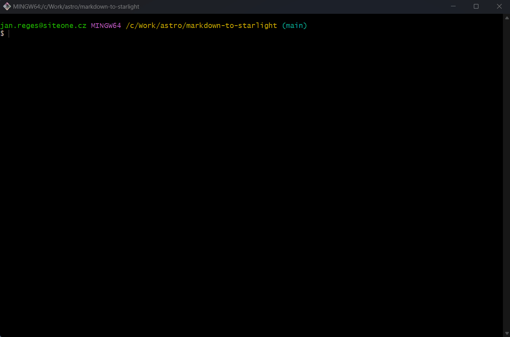

# Markdown-to-Starlight generator

A handy helper that converts single-file Markdown (typically README.md from your GitHub) into a content structure for the [Astro Starlight](https://starlight.astro.build/) tool.



## Requirements

The generator assumes the following Markdown file structure:

* the 1st level header (`#`) is ignored;
* 2nd level headings (`##`) are used as main categories in the documentation (as well as folders in `src/content/docs`);
* 3rd level headings (`###`) are used as documentation files themselves in the folders. The header name is used as the title of the page. The meta description is generated only if the content of the given section begins with a sentence with a capital character at the beginning;
* 4th level headings (`####`) are used as 2nd level headings inside generated Markdown files;
* 5th level headings (`#####`) are used as 3rd level headings inside the generated Markdown file;
* if there is any content directly between the 3rd and 4th level headings, then this content is inserted into a markdown file with the same name as the category, i.e. `docs/features/features.md`.

Example of the Markdown file structure: https://github.com/janreges/siteone-website-crawler/blob/main/README.md

## Installation

```bash
git clone https://github.com/janreges/markdown-to-starlight.git
cd markdown-to-starlight
npm install
```

## Usage

### 1) External Markdown file (URL)

**NOTE:** when you use GitHub URL, make sure you use the "raw" version of the file, not the GitHub page itself. There is a "Raw" button in the GitHub UI (on the right side) that will give you the correct URL.

```bash
npm run gen -- --url=https://raw.githubusercontent.com/janreges/siteone-website-crawler/main/README.md
```

### 2) Local Markdown file

```bash
npm run gen -- --file=/path/to/my/file.md
```

### Generated output

After successful generation you will find:

* directory `tmp/src/content/docs` with directory structure and Markdown files with organized content for Starlight (copy it to your project and edit as needed);
* file `tmp/astro.config.mjs` with JSON attribute `sidebar`, which you can copy inside `astro.config.mjs` in your Starlight project.

## Roadmap

In the case of interest in this tool, the following improvements come into consideration:

* [ ] support for other languages (for now, heading to dir/file name conversion will not remove diacritics)
* [ ] support for more complex and multi-file Markdown-based documentation
* [ ] support for downloading images and other assets from Markdown files
* [ ] support for more complex Markdown syntax (e.g. tables)

## Contribution

If you have any ideas for improvements, please create an issue or pull request.

## The MIT License (MIT)

Copyright © `2023` `jan.reges@siteone.cz`

Permission is hereby granted, free of charge, to any person
obtaining a copy of this software and associated documentation
files (the “Software”), to deal in the Software without
restriction, including without limitation the rights to use,
copy, modify, merge, publish, distribute, sublicense, and/or sell
copies of the Software, and to permit persons to whom the
Software is furnished to do so, subject to the following
conditions:

The above copyright notice and this permission notice shall be
included in all copies or substantial portions of the Software.

THE SOFTWARE IS PROVIDED “AS IS”, WITHOUT WARRANTY OF ANY KIND,
EXPRESS OR IMPLIED, INCLUDING BUT NOT LIMITED TO THE WARRANTIES
OF MERCHANTABILITY, FITNESS FOR A PARTICULAR PURPOSE AND
NONINFRINGEMENT. IN NO EVENT SHALL THE AUTHORS OR COPYRIGHT
HOLDERS BE LIABLE FOR ANY CLAIM, DAMAGES OR OTHER LIABILITY,
WHETHER IN AN ACTION OF CONTRACT, TORT OR OTHERWISE, ARISING
FROM, OUT OF OR IN CONNECTION WITH THE SOFTWARE OR THE USE OR
OTHER DEALINGS IN THE SOFTWARE.
